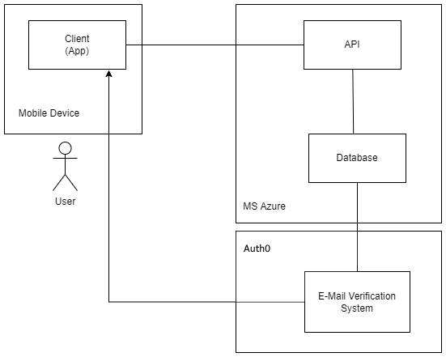

# Software Architecture Document

# Table of Contents

- [Introduction](#1-introduction)
  - [Purpose](#11-purpose)
  - [Scope](#12-scope)
  - [Definitions, Acronyms and Abbreviations](#13-definitions-acronyms-and-abbreviations)
  - [References](#14-references)
  - [Overview](#15-overview)
- [Architectural Representation](#2-architectural-representation)
- [Architectural Goals and Constraints](#3-architectural-goals-and-constraints)
- [Use-Case View](#4-use-case-view)
- [Logical View](#5-logical-view)
  - [Overview](#51-overview)
  - [Architecturally Significant Design Packages](#52-architecturally-significant-design-packages)
- [Process View](#6-process-view)
- [Deployment View](#7-deployment-view)
- [Implementation View](#8-implementation-view)
- [Data View](#9-data-view)
- [Size and Performance](#10-size-and-performance)
- [Quality](#11-quality)

## 1. Introduction

### 1.1 Purpose

This document provides a comprehensive architectural overview of the system, using a number of different architectural views to depict different aspects of the system. It is intended to capture and convey the significant architectural decisions which have been made on the system.

### 1.2 Scope

This document describes the architecture of the DHBW-Experts project.

### 1.3 Definitions, Acronyms and Abbreviations

| Abbrevation | Description                         |
| ----------- | ----------------------------------- |
| API         | Application programming interface   |
| MVC         | Model View Controller               |
| REST        | Representational state transfer     |
| SRS         | Software Requirements Specification |
| UC          | Use Case                            |
| VCS         | Version Control System              |
| n/a         | not applicable                      |

### 1.4 References

| Title                                                                    | Publishing organization |
| ------------------------------------------------------------------------ | ----------------------- |
| [DHBW-Experts Blog](https://dhbw-experts.github.io/)                     | DHBW-Experts Team       |
| [GitHub Organization](https://github.com/DHBW-Experts)                   | DHBW-Experts Team       |
| [UC Authenticate Email](./UseCases/use_case_Authenticate-Email.md)       | DHBW-Experts Team       |
| [UC Edit Skilltag](./UseCases/use_case_Edit-skilltag-in-user-profile.md) | DHBW-Experts Team       |
| [UC Fillout User Profile](./UseCases/use_case_Fill-out-user-profile.md)  | DHBW-Experts Team       |
| [UC Verify Skilltag](./UseCases/use_case_Verify-skilltags.md)            | DHBW-Experts Team       |
| [SRS](README.md)                                                         | DHBW-Experts Team       |

### 1.5 Overview

This document contains the Architectural Representation, Goals and Constraints as well
as the Logical, Deployment, Implementation and Data Views.

## 2. Architectural Representation

MVC-Pattern:
Since Ionic/Angular and Web Applications in general don't really comply with the MVC pattern it's hard to specify which component is a Model/View/Controller
Nevertheless, the application can be split up into three parts, which are more ore less applicable to the MVC model.

- All HTML pages are equal to a **view**
- All app.component.ts files (which are bound to every page) are equal to a **controller**
- Separate files specifying Users, Tags and TagValidations are identical to **models**

## 3. Architectural Goals and Constraints

The Client uses the (kind of) MVC pattern. We seperate models from controllers and views as described in the following paragraphs.

### Client-side

On the client side, which will be written in TypeScript, we use the Angular framework.

#### MVC

The main goal of the MVC architecture is to separate the view from the logic. Therefore, the view does not implement the logic, but gets all the precompiled information from the controller.
Models contain the data that is displayed in the views.

## 4. Use-Case View

## 5. Logical View

### 5.1 Overview

### 5.2 Architecturally Significant Design Packages

This image represents the logical view at our MVP Implementation:

Client:
This diagram is work in progress :)

TODO: Add link to file to view in full size

## 6. Process View

n/a

## 7. Deployment View

### Server

The main-Branch of our database-API is automatically build in the Cloud with a GitHub-Actions script and deployed to an Azure-Dev Web-App-Server. New API-Interfaces are therefore live after every push.

### Client

_To be implemented_  
Our App is not yet deployed regularly and automatically since we use an Virtual Android Machine to test our App. .apk Files are only usefull for final deployment (which still a long way to go...). In addition, we think of publishing to the Google Playstore.

## 8. Implementation View

n/a

## 9. Data View

Database ER-Diagram:

## 10. Size and Performance

n/a

## 11. Quality/Metrics

n/a
