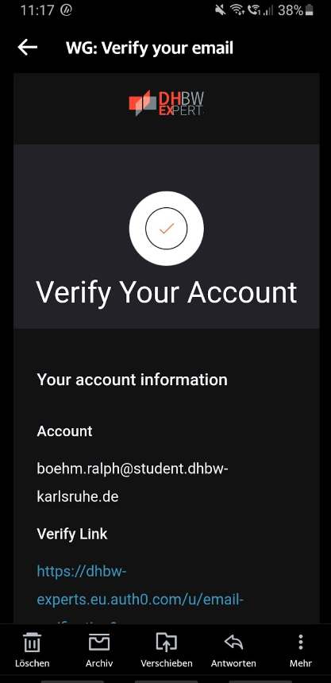

# 1 Authenticate E-mail Address

## 1.1 Brief Description

Every user has to be a student from the DHBW in Germany, therefore they need to verify their e-mail address with the domain '@student.dhbw-karlsruhe.de' since only students from the DHBW got such an e-mail address.

# 2 Flow of Events

## 2.1 Basic Flow

- User clicks on "Registrierung abschließen" button.
- User gets a new window with a textfield "Bestätigungscode".
- User checks his latest e-mail and enters the code from the mail into the textfield.
- User clicks on "Code überprüfen" button.
- User gets to the homepage of the app if the code was correct.

### 2.1.1 Activity Diagram


### 2.1.2 Mock-up



### 2.1.3 Narrative

```gherkin
Feature: E-mail authentification

  As a new user
  I want to register to the app
  and I want to be confirmed as a student of the DHBW

  Background:
    Given I am on the registration window.

  Scenario: verify my e-mail address successfully
    Given I filled out my user profile
    When I click on "Registrierung abschließen"
    Then I am asked to enter a confirmation code that was sent to my e-mail address
    When I enter EXAMPLE_CODE in the textfield "Bestätigungscode"
    And I click on "Code überprüfen"
    And the codes are similar
    Then the homepage of the app is shown

  Scenario: failing to verify my e-mail address
    Given I filled out my user profile
    When I click on "Registrierung abschließen"
    Then I am asked to enter a confirmation code that was sent to my e-mail address
    When I enter EXAMPLE_CODE in the textfield "Bestätigungscode"
    And I click on "Code überprüfen"
    And the codes are not similar
    Then a message is shown "Falscher Bestätigungscode" with buttons "Erneut senden" and "Zurück zur Registrierung"
```

## 2.2 Alternative Flows

(n/a)

# 3 Special Requirements

(n/a)

# 4 Preconditions

## 4.1 Login

The user has to be logged in to the system.

# 5 Postconditions

(n/a)

# 6 Extension Points

(n/a)
