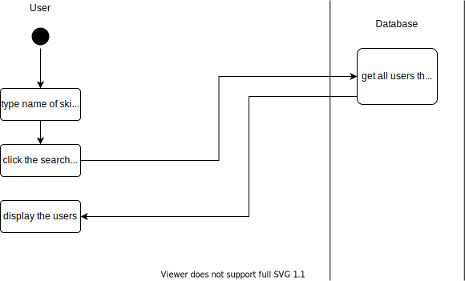

# 1 Find others by skilltags

## 1.1 Brief Description

Every user is able to search for skilltags. Due to the fact skilltags are bound to other users, you can find other users by searching for their skills.

# 2 Flow of Events

## 2.1 Basic Flow

- User clicks on the search bar and his smartphone keyboard appears.
- User enters a skill to search for.
- The searching results are shown unsorted below the search bar.

### 2.1.1 Activity Diagram



### 2.1.2 Mock-up


### 2.1.3 Narrative

```gherkin
Feature: search for skilltags


  As a signed in user
  i want to search for skilltags
  and find persons with those tags in order to help me

  Background:
    Given I am logged in

  Scenario: search for a skilltag EXAMPLE_SKILL
    Given I am on the homepage
    When I click on the search field
    And I enter EXAMPLE_SKILL
    And I submit my key word
    Then I receive the results below the search bar
    And I can click on the results to get to the persons profile behind the skilltag
```

## 2.2 Alternative Flows

(n/a)

# 3 Special Requirements

(n/a)

# 4 Preconditions

## 4.1 Login

The user has to be logged in to the system.

# 5 Postconditions

(n/a)

# 6 Extension Points

(n/a)
