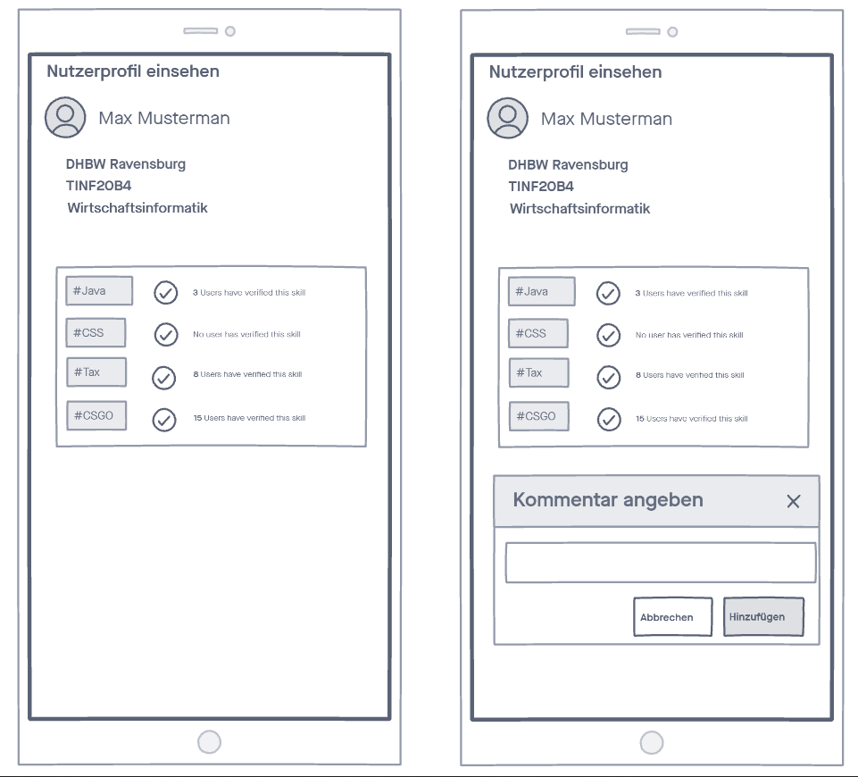

# 1 Verify skilltags

## 1.1 Brief Description

Every user can get his skills verified by other users. Furthermore, every user is also able to verify the skills of others.
This works just by clicking a check box and writing a short comment.

# 2 Flow of Events

## 2.1 Basic Flow

- User clicks on the profile button of another user.
- User gets an overview of the persons profile with all his skilltags.
- User clicks on the hook next to one certain skilltag.
- User enters a comment and clicks on "Verifizieren" button.
- User is again on the overview page of the persons profile, the one certain skilltag cannot be verified again.

### 2.1.1 Activity Diagram


### 2.1.2 Mock-up



### 2.1.3 Narrative

```gherkin
Feature: verify skilltags

  As a signed in user
  I want to verify the skills of others
  after I received help due to one of their skills

  Background:
    Given I am signed in 

  Scenario: verify skill EXAMPLE_SKILL
    Given I am on the profile page of another user
    When I click on the hook button next to the tag EXAMPLE_SKILL
    Then a pop-up appears with a textbox and two buttons "Abbrechen" and "Verifizieren"
    When I enter a comment 
    And click on "Verifizieren"
    Then I am back on the users profile page
    And The hook for the tag EXAMPLE_SKILL is disabled
```

## 2.2 Alternative Flows

(n/a)

# 3 Special Requirements

(n/a)

# 4 Preconditions

## 4.1 Login

The user has to be logged in to the system.

# 5 Postconditions

(n/a)

# 6 Extension Points

(n/a)
